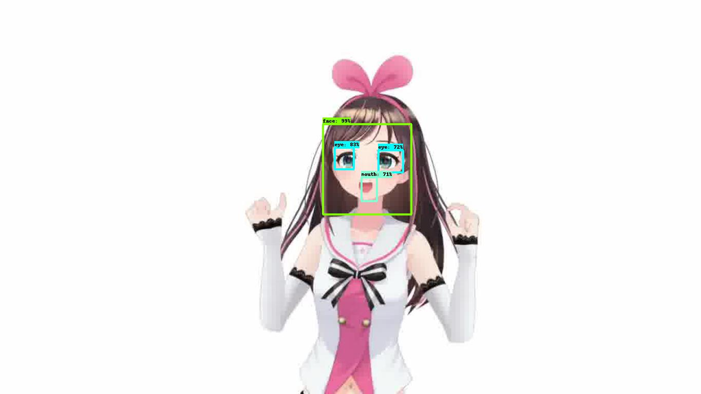
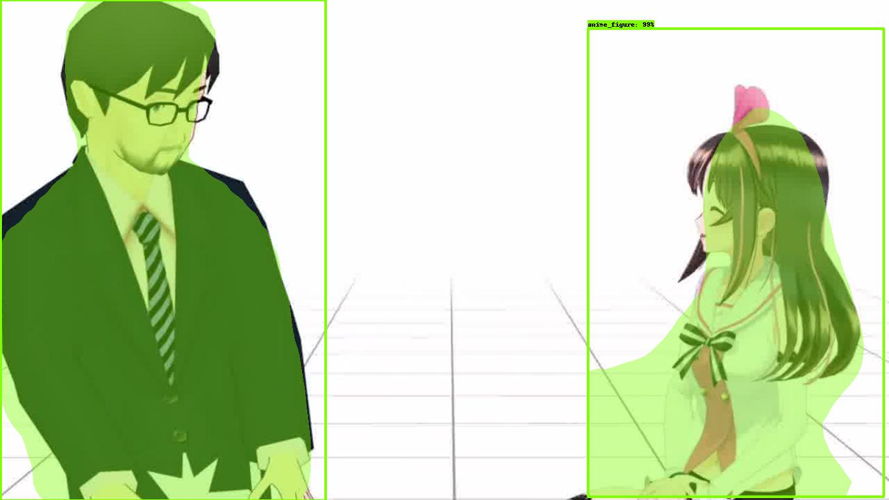
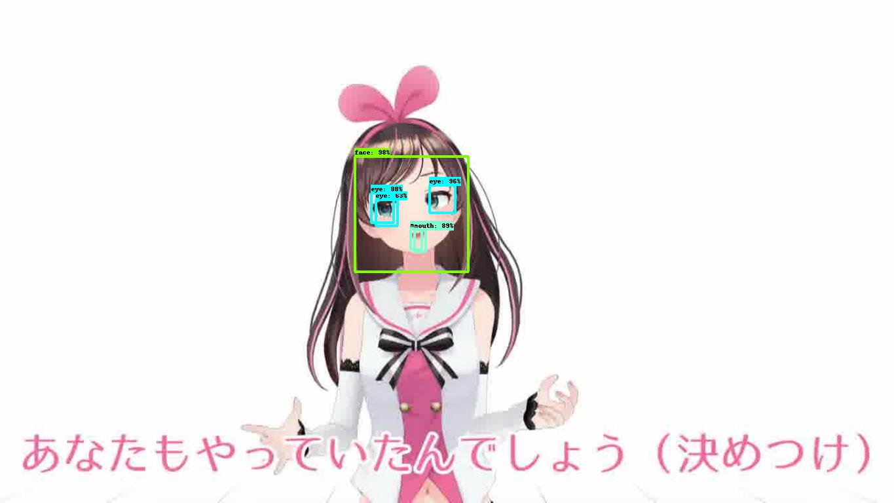
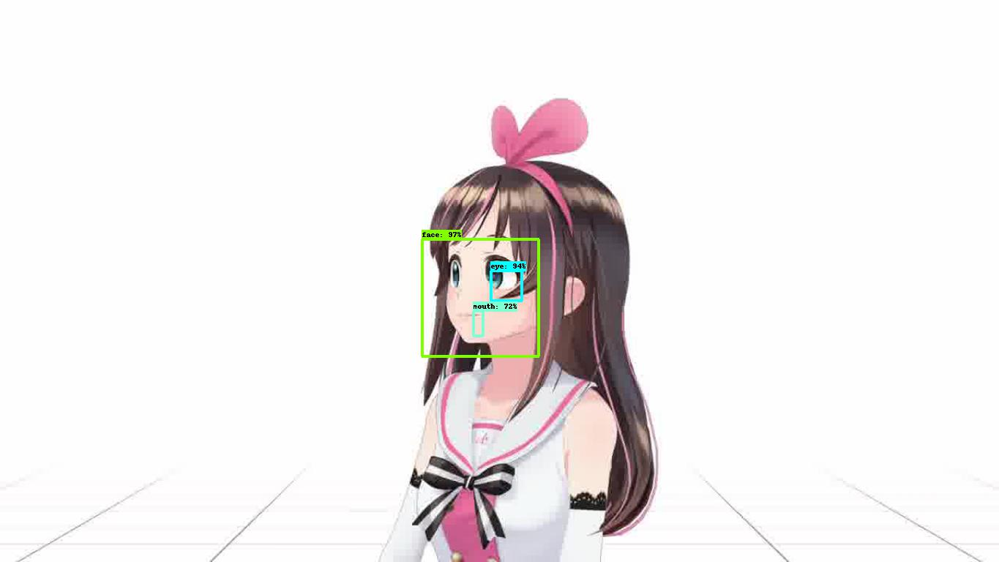
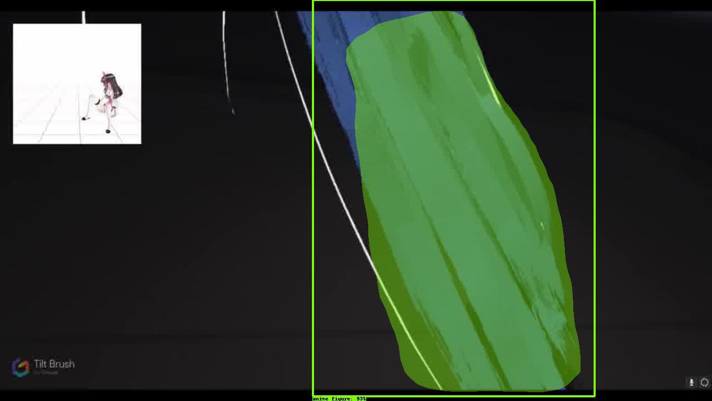
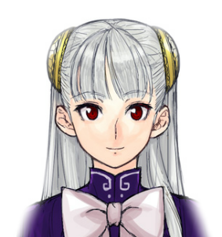

# AniSeg

Tensorflow models for Anime character object detection.

## Samples

### Face detection




### Figure segmentation




## Usage

We provide two pretrained models: One for face detection and one for figure segmentation. Download them at [Google Drive](https://drive.google.com/drive/folders/19PlNcku9V9pcJifSgWoBkZZZQhRDzV0W?usp=sharing)!

Here is a full example script to classify faces in the sample images:

```shell
# Assume you have saved the pretrained models under "model/" directory.

python infer_from_image.py \
--input_images=samples/inputs/*
--output_path=samples/face_detection_outputs
--inference_graph=model/face_detection/frozen_inference_graph.pb
--visualize_inference=True
```

In general, use the script with the following format

```shell
python infer_from_image.py \
--input_images=/PATH/TO/IMAGES/* \
--output_path=/PATH/TO/OUTPUT/FOLDER/  \
--inference_graph=/PATH/TO/frozen_inference_graph.pb  \
--visualize_inference=True
```

For figure segmentation model, please point `--inference_graph` to the segmentation model and add the additional flag

```shell
--detect_masks=True
```

## About the models

The Face Detection is trained on the outputs of [animeface-2009](https://github.com/nagadomi/animeface-2009) detector, which is under the MIT license. The main motivation for a tensorflow version is for **a much faster GPU-based detection** (5-10x speedup). 

The Figure Segmentation model is trained on our [TODO figure segmentation dataset](), which you can download [TODO here]().

Both model is trained using the [Tensorflow Object Detection](https://github.com/tensorflow/models/tree/master/research/object_detection) repo. Our repo is a simplified fork of that.

## Error cases

- Duplicate objects



- False negatives (missing detection)




- False positives



## Anime related repos and datasets

Shameless self promotion of my [TwinGAN](https://github.com/jerryli27/TwinGAN) model to turn people into anime characteres and cats!

Sketch coloring using [PaintsTransfer](https://github.com/lllyasviel/style2paints) and [PaintsChainer](http://paintschainer.preferred.tech/).

Create anime portraits at [Crypko](https://crypko.ai/) and [MakeGirlsMoe](https://make.girls.moe/#/)

The all-encompassing anime dataset [Danbooru2017](https://www.gwern.net/Danbooru2017) by gwern.

## Common questions

#### What's the use case?

Getting clean data is hard. The object detectors provided here can make that process easier. For example it can be used to crop faces from the [Danbooru2017](https://www.gwern.net/Danbooru2017) dataset. Here we show some sample results of combining the two mdoels:




#### Results are too noisy

There is always a tradeoff between precision and recall. Please adjust the `--min_score_thresh` flag accordingly. 

Higher threshold means more accurate results but also more false negatives (higher chance to miss objects). Lower value gives more faces but also contains non-face objects.

#### Inference is too slow

Inference using CPU is slow. Please make sure you have a GPU/TPU. 

If you want to create a full dataset using this model, we recommend following [TODO this guide](). 

## Todo items

- clean up code for creating tfrecords using the object detection model.
- provide figure segmentation dataset